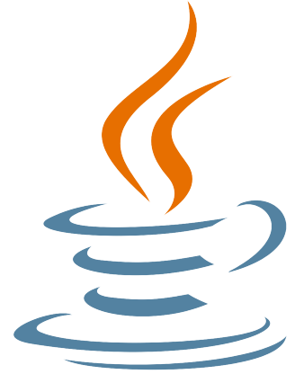
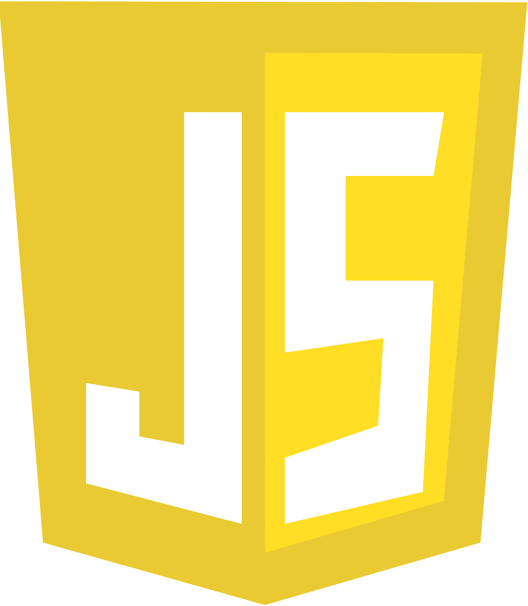

# 👋 ¡Hola! - ¡Hello!  👋
Soy **Jordi**, un programador en formación con muchas ganas de aprender. Actualmente estudio **Ingeniería Informática** en la **Universidad Politécnica de Valencia**, y estoy finalizando mi segundo curso.  

    
Haz click para ver más - 🇪🇸 Español

 
  
Fuera de la universidad, me formo continuamente en diferentes áreas de la informática. Actualmente, estoy aprendiendo **desarrollo web** con **Python y Django**, además de **HTML, CSS y JavaScript**. También me especializo en **Java** y sigo profundizando en sus conceptos.  

Además de la programación, me interesa la **impresión 3D**, el **diseño audiovisual** y la **robótica**. Otra parte fundamental de mi vida es la **solidaridad**, participando en diversos proyectos como **Novaterra** o **Movember**.  

---

## 🚀 Tecnologías  

  
  
  
  
  
  
  
  
  
  
  

---

## 🛠️ Proyectos Destacados  
🌟 **[Sorteo Medieval](https://github.com/JBDev23/SorteoMedieval)**  🎭 Aplicación web para realizar sorteos de números aleatorios.  

---

## 📌 Sobre Mí  
💡 Apasionado por la tecnología, el desarrollo web de software.  

📚 Siempre aprendiendo nuevas tecnologías y mejorando mis habilidades.  

🎯 Mi objetivo es convertirme en un desarrollador Full Stack.  

🎨 También me interesa el diseño UI/UX y el diseño e impresión 3D.   

---

## 🎯 En qué Estoy Trabajando  
🔹 Mejorando mis habilidades con **Django y Python**.

🔹 Aprendiendo desarrollo web con **HTML, CSS y JavaScript**.

🔹 Creando mi propio **portafolio**.

🔹 Desarrollando una **aplicación web** de gestión para un voluntariado.

---

## 💬 Contacto  
📩 Email: [jordibarrachinam@gmail.com](mailto:jordibarrachinam@gmail.com)  
🌐 LinkedIn: [Jordi Barrachina Méndez](https://www.linkedin.com/in/jordi-barrachina-méndez/)  
🐦 Twitter: [@JordiB_23](https://x.com/JordiB_23) 

I’m **Jordi**, a programmer in training with a strong desire to learn. I am currently studying **Computer Engineering** at the **Polytechnic University of Valencia**, and I’m finishing my second year.  

  
Click to see more - 🇬🇧 English

  
 

  
Outside of university, I continuously train in different areas of computer science. Currently, I’m learning **web development** with **Python and Django**, as well as **HTML, CSS, and JavaScript**. I also specialize in **Java** and continue deepening my knowledge in this language.  

In addition to programming, I am passionate about **3D printing**, **audiovisual design**, and **robotics**. Another fundamental part of my life is **solidarity**, participating in various projects such as **Novaterra** and **Movember**.  

---

## 🚀 Technologies  

  
  
  
  
  
  
  
  
  
  
  

---

## 🛠️ Featured Projects  
🔹 [🎲 Raffle Generator](https://github.com/JBDev23/SorteoMedieval) → Web application for conducting random draws.
🌟 **[Medieval Raffle](https://github.com/JBDev23/SorteoMedieval)**  🎭 Web applications for conducting random draws.  

---

## 📌 About Me  
💡 Passionate about technology and software development.  

📚 Constantly learning new technologies and improving my skills.  

🎯 My goal is to become a **Full Stack Developer**.  

🎨 I'm also interested in **UI/UX design** and **3D modeling & printing**.   

---

## 🎯 What I'm Working On  
🔹 Improving my skills with **Django and Python**.  

🔹 Learning **web development** with **HTML, CSS, and JavaScript**.  

🔹 Building my own **portfolio**.  

🔹 Developing a **web application** for volunteer management.  

---

## 💬 Contact  
📩 Email: [jordibarrachinam@gmail.com](mailto:jordibarrachinam@gmail.com)  
🌐 LinkedIn: [Jordi Barrachina Méndez](https://www.linkedin.com/in/jordi-barrachina-méndez/)  
🐦 Twitter: [@JordiB_23](https://x.com/JordiB_23)  

---

  
  

---

  

